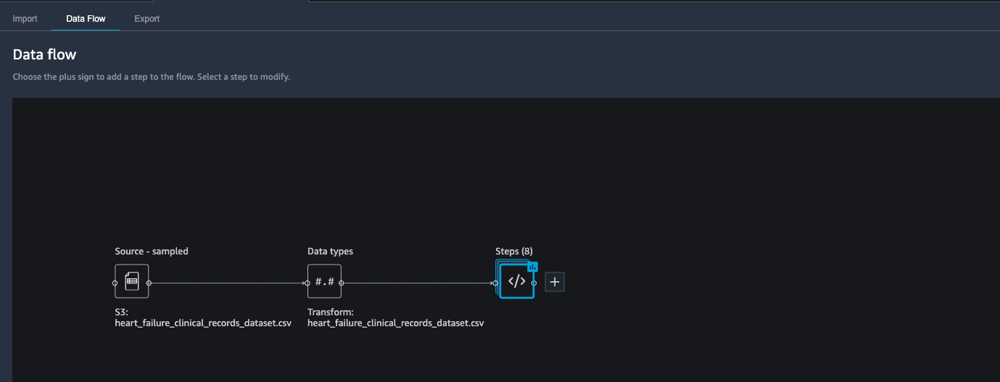
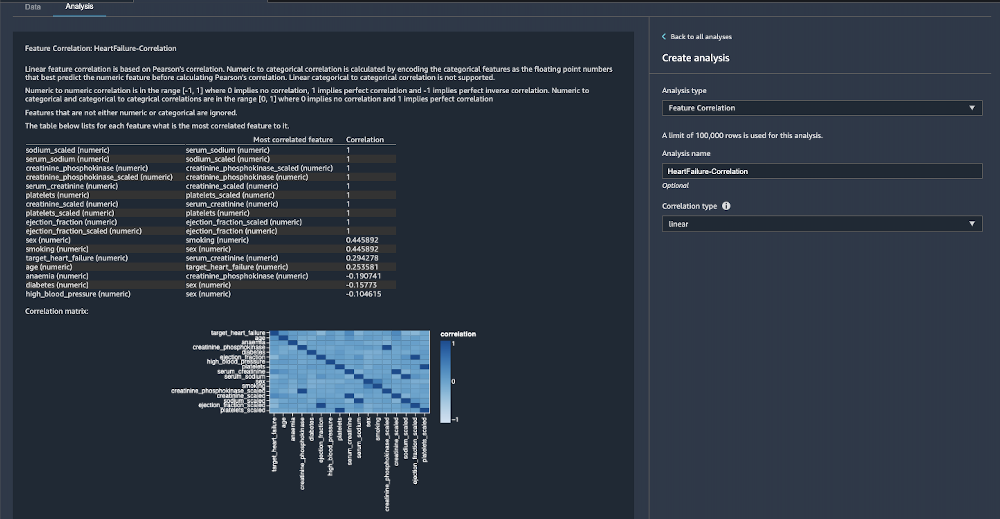
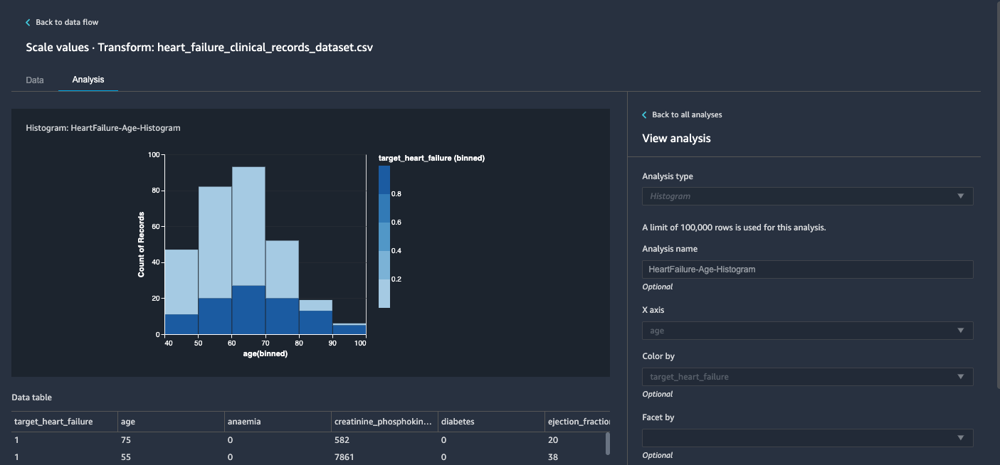
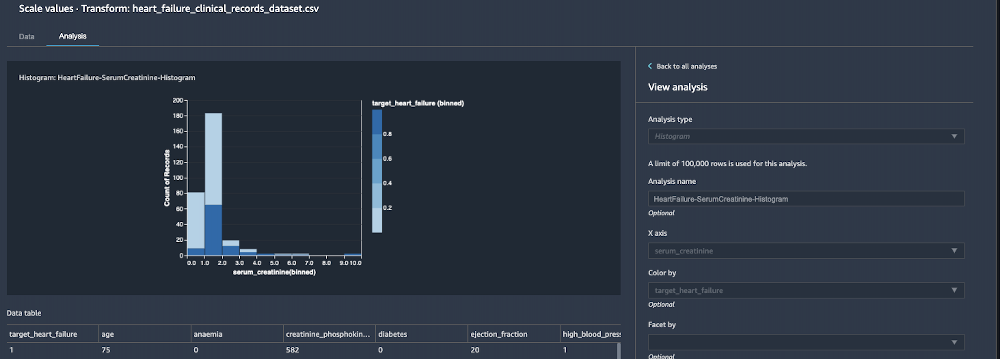
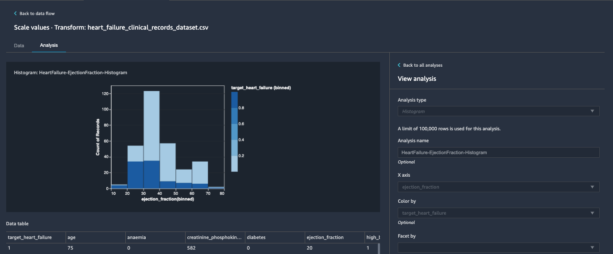
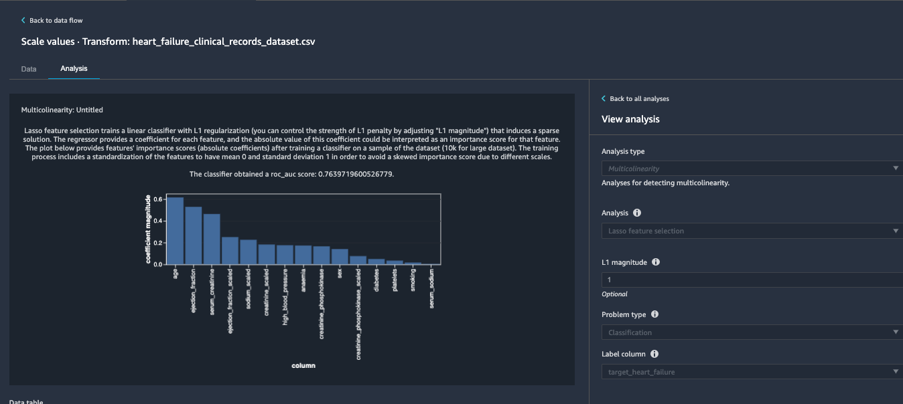
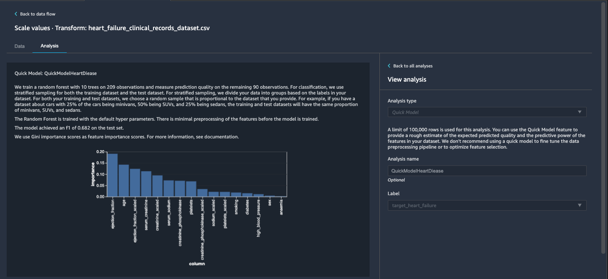

# Heart Failure Prediction Model using Amazon SageMaker

## :hospital: 0.0 Heart Failure Machine Learning Model Motivation

Improved data and analytical tools can assist healthcare providers in identifying patients who are at-risk from heart failure, thus allowing providers to proactively recommend and implement a holistic protocol consisting of lifestyle changes, pharmaceutical drugs, and advanced interventions (e.g. angioplasty, catheter ablation, stent placement, and surgery to repair valves and vessels).  Therefore, data analytics and machine learning (ML) can play an important part in the overall healthcare solution that saves lives from CardioVascular Diseases (CVD) and improves the quality and longevity of life.  This example project uses [Amazon SageMaker](https://aws.amazon.com/sagemaker/) which is managed ML service provided by AWS, and it follows the [CRISP-DM](https://en.wikipedia.org/wiki/Cross-industry_standard_process_for_data_mining) methodology in which the data analytics lifecycle consists of iterative steps:

- Business Domain Understanding
- Data Understanding
- Data Preparation
- ML Modeling
- ML Evaluation
- ML Deployment

## :heart: 1.0 Heart Failure Domain Understanding

Cardiovascular disease (CVD) is a leading cause of death globally, taking approximately 17 million lives each year. CVDs are a group of diseases of the heart and blood vessels and include coronary heart disease, cerebrovascular disease, rheumatic heart disease and other conditions. More than four out of five CVD deaths are due to heart attacks and strokes, and one third of these deaths occur prematurely in people under 70 years of age.

The most important behavioural risk factors of heart disease and stroke are unhealthy diet, physical inactivity, tobacco use and harmful use of alcohol. The effects of behavioural risk factors may show up in individuals as raised blood pressure, raised blood glucose, raised blood lipids, and overweight. These “intermediate risks factors” can be measured in primary care facilities and indicate an increased risk of heart attack, stroke, heart failure and other complications.

Cessation of tobacco use, reduction of salt in the diet, eating more fruit and vegetables, regular physical activity and avoiding harmful use of alcohol have been shown to reduce the risk of cardiovascular disease. Health policies that create conducive environments for making healthy choices affordable and available are essential for motivating people to adopt and sustain healthy behaviours.

Identifying those at highest risk of CVDs and ensuring they receive appropriate preventative and interventional treatments can improve quality and longevity of life as well as reduce the long-term cost of caring for these patients.

[Heart Disease WHO Source](https://www.who.int/health-topics/cardiovascular-diseases)

## :floppy_disk: 2.0 Heart Failure Data Understanding

The data set used to train the ML models in this project consists of 299 records of patients who experienced heart failure while at the Faisalabad Institute of Cardiology and at the Allied Hospital in Faisalabad during the period of April-December 2015; each record consists of thirteen (13) attributes and the target feature is a boolean attribute that denotes whether the patient survived the heart failure or not. Therefore, this ML problem can be framed as a supervised binary classification problem such that the target feature denotes 1 for death from heart failure and 0 for survival/no failure; the goal is to predict whether new incoming patients with a set of similar attributes will survive from heart failure or not.  Also, note that the data set was sourced from the highly regarded and curated University of California Irvine (UCI) Machine Learning Repository. 

- age: age of the patient (years)
- anaemia: decrease of red blood cells or hemoglobin (boolean)
- high blood pressure: if the patient has hypertension (boolean)
- creatinine phosphokinase (CPK): level of the CPK enzyme in the blood (mcg/L)
- diabetes: if the patient has diabetes (boolean)
- ejection fraction: percentage of blood leaving the heart at each contraction (percentage)
- platelets: platelets in the blood (kiloplatelets/mL)
- sex: woman or man (binary)
- serum creatinine: level of serum creatinine in the blood (mg/dL)
- serum sodium: level of serum sodium in the blood (mEq/L)
- smoking: if the patient smokes or not (boolean)
- time: follow-up period (days)
- [target] death event: if the patient deceased during the follow-up period (boolean)

References:
- [ML Data Source](https://archive.ics.uci.edu/ml/datasets/Heart+failure+clinical+records)
- [ML Paper by Davide Chicco and Guiseppe Jurman](https://doi.org/10.1186/s12911-020-1023-5)

## :bar_chart: 2.1 Heart Failure Data Preparation

For data exploration and preparation, I took a comprehensive approach that used Amazon Sagemaker [Data Wrangler](https://aws.amazon.com/sagemaker/data-wrangler/) as well as Jupyter notebooks applying Python libraries such as pandas, matplotlib, and seaborn to interactively explore the data set.

Amazon SageMaker Data Wrangler is a visual component for aggregating, exploring, and preparing data that simplifies the data pipeline and feature engineering process so that you can reduce the time it takes to engineer robust features for ML models from weeks and days into hours and minutes.  Data Wrangler has data connectors for S3, Athena, RedShift, Snowflake and other data sources, and it has more than 300 built-in data transforms so that you can quickly normalize, enrich, and combine features without having to write any code.  Data Wrangler enables you to also author custom transformations using Pandas, PySpark, and SQL when necessary.  Data Wrangler also has a robust set of visualization templates including correlation heatmaps, histograms, scatter plots, box and whisker plots, line charts, and bar charts that are all available to help you understand your data, identify relationships and spot outliers.  Data Wrangler has a Quick Model feature that enables you to train a simple ML model using the Random Forest algorithm and quickly diagnose issues earlier in your data pipeline before more complex models and resources are deployed into production. Data Wrangler also integrates with [SageMaker Clarify](https://aws.amazon.com/sagemaker/clarify/), making it easier to identify bias and imbalances during data preparation.  Finally, Data Wrangler workflows can be exported to a Notebook or Python script for MLOps automation; you can also publish features to [SageMaker Feature Store](https://aws.amazon.com/sagemaker/feature-store/) so that features can be reused and syndicated across ML initiatives and data science teams.

#### 2.1.1 Data Wrangler - Data Import

First, I imported the data from an Amazon [S3](https://aws.amazon.com/s3/) storage bucket where I had already uploaded the CSV file from the UCI ML repository using the following Python code.

```
# cell 00 ... setup Exploratory Data Analysis of Heart Disease Data
import boto3
import sagemaker
from sagemaker import get_execution_role

region = boto3.Session().region_name

session = sagemaker.Session()
s3_bucket = session.default_bucket()
s3_prefix = 'sagemaker/heartdisease/data/'

s3 = boto3.Session().resource('s3')
local_data_filename = 'heart_failure_clinical_records_data.csv'
!wget https://archive.ics.uci.edu/ml/machine-learning-databases/00519/heart_failure_clinical_records_dataset.csv -O heart_failure_clinical_records_data.csv

s3.Bucket(s3_bucket).upload_file(local_data_filename, s3_prefix + local_data_filename)
```

#### 2.1.2 Data Wrangler - Data Preparation - Data Types and Transformation Flow

Second, I applied data type transformations to convert the columns from the raw character/string types to numeric types because ML models typically require that the input columns be numeric.  

Third, I scaled some of the non-boolean numeric columns using the standardization transform so that the scaled columns have a mean of 0 and standard deviation of 1; these scaled columns reduce the impact of outliers and improve the fit of the algorithm to the supervised training data as well as its ability to generally perform predictions on the evaluation and actual data in the real world.

For both of these operations, Data Wrangler simplifies the data pipeline process with easy, built-in operations that can be created visually in a data pipeline [workflow](02a-DataWrangler-heartdisease-DataFlow.flow) without any code.



#### 2.1.3 Data Wrangler - Data Visualization

Fourth, I generated several visual, analytical outputs including correlations, histograms, and table summary statistics; again, all of these analytical visual artifacts are produced conveniently and simply within the visual IDE without any code.



Based on the correlation heatmap, one can see that the attributes for serum creatinine, ejection fraction, serum sodium, age, and blood pressure have the top 5 highest correlations with our primary target_heart_failure feature; moreover, there appears to be secondary correlation between sex and smoking, diabetes, and high blood pressure.  Furthermore, if we examine the histograms below for age, creatinine, and ejection fraction, one can observe high density clusters for each aforementioned attribute around 60+, above 1.0+, and below 40% respectively.







#### 2.1.4 Data Wrangler - Data Analysis - Collinearity Lasso Feature Selection

Next, I performed a collinearity attribute analysis on the data set columns to double check the earlier correlations and ensure that the most important attributes are included in the ML model.  SageMaker Data Wrangler's Collinearity feature uses a simple Linear Model, and it can be run in the context of classification or regression problems.  In this case, it builds the linear classifier with L1 term regularization and you can control the strength of the L1 penalty.  The classifier itself has a ROC AUC score of 76.3% which is within the order of accuracy of previous work done on this data set without any tuning yet.  Furthermore, the collinearity analysis again confirms that age, ejection fraction, serum creatinine, sodium, and blood pressure.  Also, note that classifier standardizes features to have mean 0 and standard deviation 1.



#### 2.1.5 Data Wrangler - Data Analysis - Quick Model

Next, I ran a SageMaker Quick Model analysis that uses the Random Forest algorithm to predict the binary classifaction of the target_heart_failure feature.  The model was trained with the default hyper parameters with no custom tuning and there was minimal preprocessing of the features.  Nonetheless, the model achieved an F1 score of 0.682 on the test data set and it also surfaces feature importance as a triple-check of earlier results, again confirming that ejection fraction, age, serum creatinine, and sodium are consequential features.



#### 2.1.6 Data Wrangler - Clean Up

When you are not using Data Wrangler, it is important to shut down the instance on which it runs to avoid incurring additional fees.

To avoid losing work, save your data flow before shutting Data Wrangler down. To save your data flow in Studio, select File and then select Save Data Wrangler Flow. Note that Data Wrangler automatically saves your data flow every 60 seconds.

To shut down the Data Wrangler instance in Studio:

- In Studio, select the Running Instances and Kernels icon.
- Under RUNNING APPS is the sagemaker-data-wrangler-1.0 app. Select the shut down icon next to this app.

#### 2.2.1 Jupyter Notebook

While many of the aformentioned data investigations can be performed conveniently in Data Wrangler, the inquisitive reader is invited to examine and inspect a Jupyter [notebook](02b-HeartDisease-ExploratoryDataAnalysis.ipynb) that performs several similar operations through the use of pandas, matplotlib, and seaborn Python libraries.  Again, this approach makes sense when your data set is very large (TBs of data with billions of rows), unstructured (e.g. image, audio, video, text), or requires complex column transformations beyond the existing set of 300+ built-in transformations available in Data Wrangler.

## :brain: 3.0 Heart Failure Machine Learning Model Build and Tune

Now that the data set has been engineered for features, we can begin to build, evaluate, and tune ML models.  Amazon SageMaker has a robust, easy-to-use set of components to build and tune ML models.

First, SageMaker supports almost two dozen built-in [Algorithms](https://docs.aws.amazon.com/sagemaker/latest/dg/algos.html), and it also enables you to bring your own and customize the model further.  Since this Heart Disease project has been framed as a binary classification problem on tabular data, I planned to use the Linear Learner, Random Forest, and XGBoost models which are all appropriate for tabular data.

Second, I planned to test different sets of hyperparameters across the aforementioned algorithms.  Tracking all these iterative activities in an effective manner was a good opportunity to use SageMaker [Experiments](https://aws.amazon.com/blogs/aws/amazon-sagemaker-experiments-organize-track-and-compare-your-machine-learning-trainings/) which enables you to organize, track, compare, and evaluate your machine learning experiments.  SageMaker Experiments automatically tracks the inputs, parameters, configurations, and results of your iterations as trials. You can assign, group, and organize these trials into experiments. SageMaker Experiments is integrated with Amazon SageMaker Studio providing a visual interface to browse your active and past experiments, compare trials on key performance metrics, and identify the best performing models.  In this project, there was one parent Experiment (sm-heartdisease-exp-YYYY-mm-dd), one child trial for each algorithm (sm-heartdisease-trial-algo-YYYY-mm-dd), and multiple trial components (e.g. grandchildren) associated to the artifacts each hyper parameter set assigned to the algorithm.

Third, I needed to efficiently explore the universe of hyperparameters appropriate to each algorithm and find the best version of a model.  Again, this was an opportunity to leverage another SageMaker component for [Automated Model HyperParameter Tuning](https://aws.amazon.com/blogs/machine-learning/amazon-sagemaker-automatic-model-tuning-produces-better-models-faster/) which executes many training jobs in parallel on your data set using the algorithm and rangers of hyperparameters you specify.  It then chooses the hyperparameter values that result in a model that performs the best, as measured by a metric that you choose.

Fourth, I needed to understand what features were important to the best performing model in each algorithmic family and how important they were.  Amazon SageMaker [Clarify](https://aws.amazon.com/blogs/aws/new-amazon-sagemaker-clarify-detects-bias-and-increases-the-transparency-of-machine-learning-models/)  provides tools to help explain how machine learning (ML) models make predictions as well as determine whether data used for training models encodes any bias. These tools can help ML modelers and developers and other internal stakeholders understand model characteristics as a whole prior to deployment and to debug predictions provided by the model after it's deployed. Transparency about how ML models arrive at their predictions is also critical to consumers and regulators who need to trust the model predictions if they are going to accept the decisions based on them. SageMaker Clarify uses a model-agnostic feature attribution implementation of SHAP, based on the concept of a Shapley value from the field of cooperative game theory that assigns each feature an importance value for a particular prediction.

#### 3.1 Linear Learner Model

#### 3.2 Random Forest Model

#### 3.3 XGBoost Model

#### 3.4 Comparing the ML Models

## :computer: 4.0 Heart Failure Machine Learning Model Deployment

abc123

## :sun_behind_large_cloud: 5.0 Conclusion

abc123
